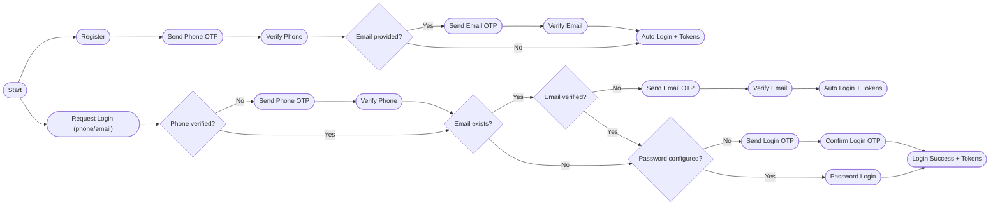
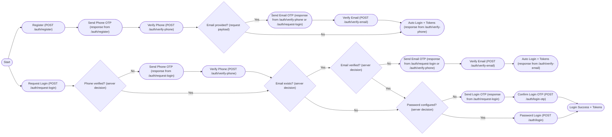

# Auth Onboarding & Login Flow

This document describes the full auth decision flow for registration and login, including server `nextStep` behavior, OTP usage, and auto-login rules.

## Goals

- Verify ownership of phone (mandatory) and email (optional).
- Allow password login only when the user explicitly chooses to log in via `POST /auth/request-login`.
- Auto-login the user immediately after the final verification step (phone or email) during onboarding or verification flows.
- Use `nextStep` as the single source of truth for the client UI.

## Core Concepts

### Next Step Values

The backend always returns a `nextStep` that tells the client what to do next:

- `verify_phone`
- `verify_email`
- `password_required`
- `confirm_login`
- `login_complete`

`password_required` and `confirm_login` are only returned by `POST /auth/request-login`.

### OTP Purposes

OTP codes are issued for three purposes:

- **Phone verification**: confirm ownership of the phone number.
- **Email verification**: confirm ownership of the email address.
- **Login confirmation**: confirm login when no password is configured (request-login flow only).

### Auto-login Rule

After the **final verification step** is complete (phone or email), the server returns:

```json
{ "nextStep": "login_complete", "tokens": { ... } }
```

This applies to:

- `POST /auth/verify-phone` when there is **no email to verify**.
- `POST /auth/verify-email` after the email is verified.

## Mermaid Diagram



## API Flow (Endpoints)



## Detailed Step-By-Step Behavior

### 1) Register
Endpoint: `POST /auth/register`

- Creates the user and always returns `nextStep: verify_phone` with a phone OTP.
- Email is optional; if provided, it will be verified **after** the phone is verified.

### 2) Verify Phone
Endpoint: `POST /auth/verify-phone`

- Marks phone as verified when OTP is valid.
- If the user has an email that is **not verified**, returns `nextStep: verify_email` and sends email OTP.
- Otherwise, returns `nextStep: login_complete` with tokens (auto-login).

### 3) Verify Email
Endpoint: `POST /auth/verify-email`

- Marks email as verified when OTP is valid.
- Requires the phone to already be verified.
- Always returns `nextStep: login_complete` with tokens (auto-login).

### 4) Request Login
Endpoint: `POST /auth/request-login`

This is the **only** entry point that can require a password or login-OTP confirmation.

Decision order:

1. If phone is not verified ? `verify_phone` (send phone OTP)
2. If email exists but not verified ? `verify_email` (send email OTP)
3. If password is configured ? `password_required`
4. If no password configured ? `confirm_login` (send login OTP)

### 5) Password Login
Endpoint: `POST /auth/login`

- Validates password and returns tokens.
- Requires phone verified, and email verified if the user has an email.

### 6) Login Confirmation (OTP)
Endpoint: `POST /auth/login-otp`

- Confirms login via OTP when no password is configured (request-login flow only).
- Returns `nextStep: login_complete` with tokens.

## Client UI Mapping

Use `nextStep` to route the user:

- `verify_phone` ? show phone OTP input, call `POST /auth/verify-phone`
- `verify_email` ? show email OTP input, call `POST /auth/verify-email`
- `password_required` ? show password screen, call `POST /auth/login`
- `confirm_login` ? show OTP input, call `POST /auth/login-otp`
- `login_complete` ? store tokens and proceed to app

## Notes

- Phone is mandatory for all users and must be verified first.
- Email is optional; if present it must be verified before password or login OTP confirmation.
- Password confirmation is only required during the login flow after phone verification and (if present) email verification.
- Once the final verification is complete (phone or email), the user is auto?logged in.
- Preferred phone channel is respected when sending phone OTP.
