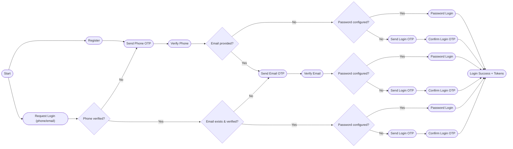
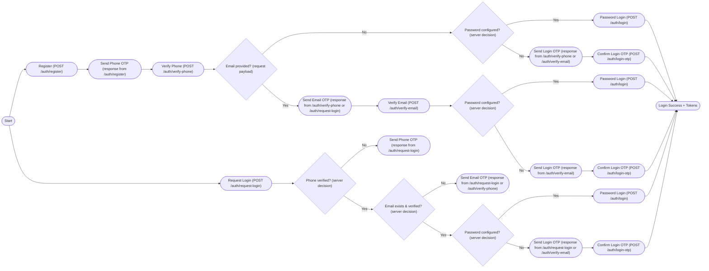

# Auth Onboarding & Login Flow

This document describes the onboarding and login decision flow.

## Mermaid Diagram

## API Flow (Endpoints)

## Notes

- Phone is mandatory for all users and must be verified first.
- Email is optional; if present it must be verified before password or login OTP confirmation.
- If no password is configured, successful verification results in a login OTP confirmation.
- Preferred phone channel is respected when sending phone OTP.
